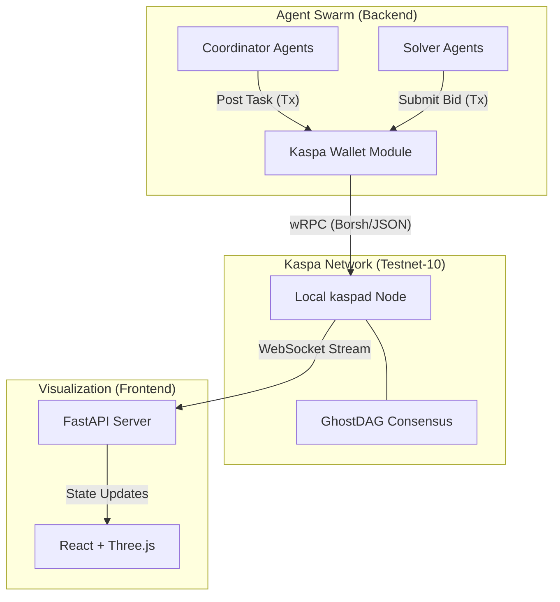
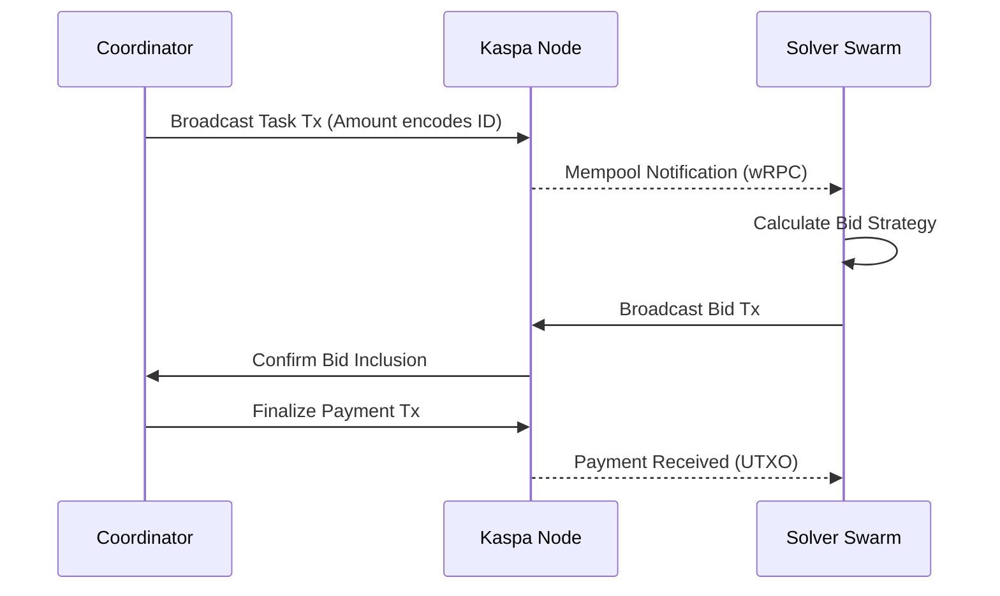

# KaspaSwarm 🐝⚡


> **Decentralized AI agent coordination using Kaspa blockchain as a coordination layer**

KaspaSwarm demonstrates a revolutionary use case for blockchain: **real-time coordination of autonomous AI agents**. Each agent decision, bid, and coordination signal is an on-chain transaction, showcasing Kaspa's millisecond block times that enable multi-agent systems impossible on traditional blockchains.

## 🎯 Why Kaspa?

- ⚡ **Sub-second confirmations** - Agents coordinate in real-time
- 🔄 **High throughput** - Hundreds of coordination transactions per second
- 🌐 **Decentralized** - No central coordinator or message broker
- 🔒 **Immutable** - All agent decisions auditable on-chain (GhostDAG consensus)

## 🏗️ Architecture



### Transaction Flow

1. **Task Creation**: Coordinator broadcasts a transaction with metadata in the amount (e.g., `1000.42` KAS).
2. **Bidding**: Solvers see the transaction in the mempool and submit bid transactions.
3. **Execution**: Winner is selected via consensus rules; payment is released.



## 🚀 Quick Start

### Prerequisites

- Python 3.11+
- Node.js 18+
- [Rusty Kaspa (kaspad)](https://github.com/kaspanet/rusty-kaspa) (for local node)

### 1. Setup Local Node (Required for Real Transactions)

We use a local `kaspad` node to ensure stable testnet-10 connectivity.

```bash
# Download and run kaspad
# (See rusty-kaspa repo for binaries)
./kaspad --testnet --netsuffix=10 --rpclisten-json=default --utxoindex
```

### 2. Backend Setup

```bash
cd backend
python -m venv venv
source venv/bin/activate  # On Windows: venv\Scripts\activate
pip install -r requirements.txt

# Configure environment
cp ../.env.example ../.env
# Edit .env: Set MOCK_MODE=false to use real blockchain
```

### 3. Frontend Setup

```bash
cd ../frontend
npm install
npm run dev
```

## 🔧 Technical Implementation

KaspaSwarm implements a full cryptographic stack in Python to interact with the Kaspa network directly:

### Cryptography & Wallet

- **Sighash**: Custom Blake2b implementation for Kaspa transaction signing.
- **Schnorr**: BIP-340 Schnorr signatures on secp256k1 curve.
- **Address**: Bech32 address encoding/decoding (`kaspatest:...`).
- **UTXO Management**: Manual UTXO selection and transaction construction.

### Communication

- **wRPC Client**: Asynchronous WebSocket client using JSON-RPC protocol.
- **Fallbacks**: Automatic failover to REST API if wRPC is unavailable.

## 🎮 Features

✅ **2 Coordinator Agents** posting tasks  
✅ **8 Solver Agents** with skill-based bidding strategies  
✅ **Real-time 3D Visualization** (Three.js)  
✅ **Live Transaction Monitoring** via local node wRPC  
✅ **Statistics Dashboard** showing swarm metrics  
✅ **Emergent Swarm Behavior**

## 📄 License

MIT License - see LICENSE file for details.

---

## ☁️ Deployment

For detailed instructions on deploying the Frontend to Vercel and Backend to Render/VPS, see [DEPLOYMENT.md](DEPLOYMENT.md).

---

**Built for Kaspathon 2026 🏆**
