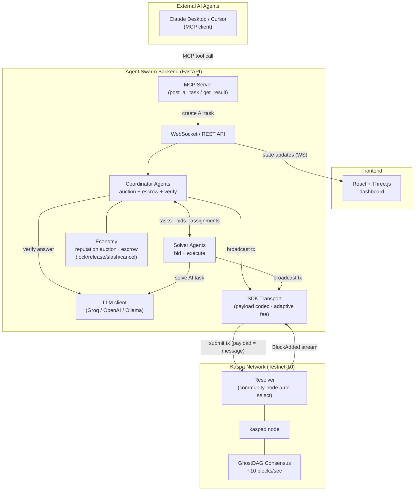
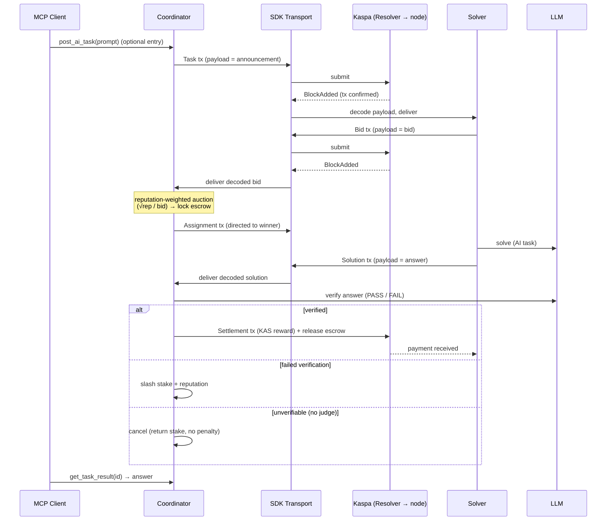

# KaspaSwarm 🐝⚡


> **Decentralized AI agent coordination using Kaspa blockchain as a coordination layer**

### 🎬 Demo Video

https://youtu.be/UKgoAD2cslM

### 🌐 Live Demo

https://kaspaswarm.vercel.app/

> ⏳ Note: The backend is hosted on Render free tier and may take ~30–60 seconds to wake on first load if inactive.


> **KaspaSwarm turns Kaspa into a real-time, decentralized coordination-and-settlement layer where autonomous AI agents hire each other, do the work, and get paid — no servers, no brokers, no trust required.**

Today, when one AI agent needs to hire another, that coordination runs through a **centralized broker** that decides who works and who gets paid. KaspaSwarm removes the broker: **coordinators** post tasks on-chain, **solvers** watch the chain, bid, get assigned, execute, and settle — every task, bid, assignment, and payment is a real Kaspa transaction (carried in the transaction *payload*). The blockchain is simultaneously the **message bus** and the **payment rail**, and the entire coordination history is public and auditable.

This is only possible because Kaspa's **blockDAG confirms ~10 blocks/second** — fast enough for agents to bid → assign → settle in real time, which slower chains (Bitcoin's 10-min, Ethereum's 12-sec blocks) simply cannot do. KaspaSwarm is a proof that a fast L1 can be the coordination bus for real machine-to-machine economies.

## 🆕 Project history & what's new

KaspaSwarm originated at **Kaspathon 2026** (4th place, Main Track · winner, Real-Time Data · winner, Best Real-World Application). This repository is an active evolution of that project for the **UK AI Agent Hackathon EP5**, with substantial new work:

- **Kaspa is now the real coordination bus** — messages moved from the transaction *amount* hack into the transaction *payload* field. Delivery is gated on **real block inclusion**: turn the chain off and the swarm stops.
- **Official Kaspa SDK transport via the Resolver** (`backend/kcore/sdk_transport.py`) — connects through the community-node Resolver (no node IP required), streams `BlockAdded` events, and builds change-aware transactions with adaptive, mass-based fees. The hand-rolled wRPC/`ChainWatcher` stack remains as a fallback.
- **Real LLM-powered agents** — solvers complete actual AI tasks via any OpenAI-compatible endpoint (Groq, OpenAI, local Ollama), and a separate LLM **verifier-agent** grades the answer before payment. Falls back to deterministic compute tasks when no LLM is configured.
- **A real agent economy** — reputation-weighted reverse auction (`√reputation / bid`) for assignment, plus in-protocol **escrow** (lock → release / slash / cancel) so honest work is paid and failed work is penalised.
- **MCP server** (`backend/mcp_server.py`) — any external AI agent (Claude Desktop, Cursor, Claude Code) can **hire the swarm** as a tool: post an AI task, the swarm bids/solves/verifies and settles on Kaspa, and the caller retrieves the result. *An agent hiring agents, settled on a fast L1.*
- **Deterministic, fundable agent wallets** + tooling (`fund_agents.py`).

> **A note on covenants:** trustless on-chain escrow via KIP-10 introspection (SilverScript) is the natural settlement primitive here, and a covenant draft is included (`backend/covenants/agent_escrow.sil`). The shipping Kaspa Python SDK (1.0.0) does not yet expose the introspection opcodes, so settlement currently runs through the in-protocol escrow described above; the abstraction (`backend/kcore/covenant.py`) is ready to swap in once the opcodes ship.

Prior-project code is disclosed as such; the items above are new work for this event.

## 📸 Screenshots

### 🐝 Swarm Live Coordination


### 📊 Performance & Metrics Dashboard


### 🛠 Task Creation & Agent Controls


## 🎯 Why Kaspa?

- ⚡ **Sub-second confirmations** - Agents coordinate in real-time
- 🔄 **High throughput** - Hundreds of coordination transactions per second
- 🌐 **Decentralized** - No central coordinator or message broker
- 🔒 **Immutable** - All agent decisions auditable on-chain (GhostDAG consensus)

## 🌍 Real-World Applications

KaspaSwarm is not just a visualization — it demonstrates a new primitive:

**Blockchain as a coordination layer for autonomous systems**

Potential applications:

• Decentralized AI compute markets  
• Autonomous trading agent coordination  
• On-chain job marketplaces for AI agents  
• Swarm robotics coordination  
• Decentralized multi-agent research systems  
• Trustless bidding/auction infrastructure

High-speed blockDAG consensus like Kaspa enables coordination latency low enough for real-time autonomous economies — something impossible on slower chains.

## 🏗️ Architecture


```mermaid
graph TD
    subgraph EXT["External AI Agents"]
        MCP["Claude Desktop / Cursor<br/>(MCP client)"]
    end

    subgraph FE["Frontend"]
        React["React + Three.js<br/>dashboard"]
    end

    subgraph BE["Agent Swarm Backend (FastAPI)"]
        MCPSrv["MCP Server<br/>(post_ai_task / get_result)"]
        API["WebSocket / REST API"]
        Coord["Coordinator Agents<br/>auction + escrow + verify"]
        Solver["Solver Agents<br/>bid + execute"]
        Econ["Economy<br/>reputation auction · escrow<br/>(lock/release/slash/cancel)"]
        LLM["LLM client<br/>(Groq / OpenAI / Ollama)"]
        TX["SDK Transport<br/>(payload codec · adaptive fee)"]

        MCPSrv --"create AI task"--> API
        API --> Coord
        Coord <--"tasks · bids · assignments"--> Solver
        Coord --- Econ
        Coord --"verify answer"--> LLM
        Solver --"solve AI task"--> LLM
        Coord --"broadcast tx"--> TX
        Solver --"broadcast tx"--> TX
    end

    subgraph KAS["Kaspa Network (Testnet-10)"]
        Resolver["Resolver<br/>(community-node auto-select)"]
        Node["kaspad node"]
        Consensus["GhostDAG Consensus<br/>~10 blocks/sec"]
        Resolver --- Node --- Consensus
    end

    MCP --"MCP tool call"--> MCPSrv
    TX --"submit tx (payload = message)"--> Resolver
    Resolver --"BlockAdded stream"--> TX
    API --"state updates (WS)"--> React
```

> Every task, bid, assignment, and solution is a real Kaspa transaction whose
> `payload` carries the message. Delivery is gated on the `BlockAdded` stream, so
> the chain is the message bus **and** the payment rail. If the SDK transport can't
> start, a hand-rolled `ChainWatcher` (wRPC) fallback decodes the same payloads.

### Transaction Flow — Kaspa as the coordination bus

Every coordination message (task, bid, assignment, solution) is a **real Kaspa
transaction whose `payload` field carries the full, JSON-encoded message** (tagged
with a `KSWARM1:` magic prefix). The **SDK transport** (via the Resolver) subscribes
to `BlockAdded` events, decodes swarm payloads out of confirmed blocks, and only
*then* delivers them to the recipient agent. **Delivery is gated on real block
inclusion** — turn the chain off and the swarm stops. Kaspa is the medium, not a
decorative anchor.

1. **Task Creation**: Coordinator broadcasts a tx; the `payload` is the task announcement.
2. **Observation**: The transport sees the block, decodes the payload, delivers it to solvers.
3. **Bidding**: Solvers broadcast bid txs (payload-encoded) from their own funded addresses.
4. **Assignment**: Coordinator runs a **reputation-weighted reverse auction** (`√reputation / bid`), locks **escrow**, and broadcasts a directed assignment tx to the winner.
5. **Execution & Verification**: The winning solver does the work (LLM for AI tasks, deterministic compute otherwise); the coordinator verifies the result (an LLM **verifier-agent** for AI tasks).
6. **Settlement**: On a verified solution the reward is paid as a native KAS transfer and escrow is **released**; a failed answer is **slashed**; an unverifiable one (e.g. no judge available) is **cancelled** (stake returned, no penalty).


```mermaid
sequenceDiagram
    participant M as MCP Client
    participant C as Coordinator
    participant T as SDK Transport
    participant K as Kaspa (Resolver → node)
    participant S as Solver
    participant L as LLM

    M->>C: post_ai_task(prompt) (optional entry)
    C->>T: Task tx (payload = announcement)
    T->>K: submit
    K-->>T: BlockAdded (tx confirmed)
    T->>S: decode payload, deliver
    S->>T: Bid tx (payload = bid)
    T->>K: submit
    K-->>T: BlockAdded
    T->>C: deliver decoded bid
    Note over C: reputation-weighted auction<br/>(√rep / bid) → lock escrow
    C->>T: Assignment tx (directed to winner)
    S->>L: solve (AI task)
    S->>T: Solution tx (payload = answer)
    T->>C: deliver decoded solution
    C->>L: verify answer (PASS / FAIL)
    alt verified
        C->>K: Settlement tx (KAS reward) + release escrow
        K-->>S: payment received
    else failed verification
        C->>C: slash stake + reputation
    else unverifiable (no judge)
        C->>C: cancel (return stake, no penalty)
    end
    M->>C: get_task_result(id) → answer
```

> A bulletproof in-memory fallback delivers messages if a broadcast fails, so a
> flaky node never freezes a live demo. In simulation mode the same flow runs
> entirely in-memory.

## 🚀 Quick Start

### Prerequisites

- Python 3.11+
- Node.js 18+
- A funded **testnet-10** address (get TKAS from the [faucet](https://faucet-tn10.kaspanet.io/))
- *(optional)* [Rusty Kaspa (kaspad)](https://github.com/kaspanet/rusty-kaspa) only if you prefer the `handrolled` transport against your own node

### 1. Network Connectivity

The default `sdk` transport connects to testnet-10 through the **community-node
Resolver** — **no local node or node IP required**. Just fund a testnet address and go.

If you'd rather run your own node, set `KASPA_TRANSPORT=handrolled` and point
`KASPA_WS_URL` at it:

```bash
# Optional: only for the handrolled transport
./kaspad --testnet --netsuffix=10 --rpclisten-json=default --utxoindex
```

### 2. Backend Setup

```bash
cd backend
python -m venv venv
source venv/bin/activate  # On Windows: venv\Scripts\activate
pip install -r requirements.txt

# Configure environment
cp ../.env.example ../.env
```

Edit `.env` for **live mode**:

```bash
MOCK_MODE=false
KASPA_NETWORK=testnet-10
KASPA_TRANSPORT=sdk                         # SDK + Resolver (no node IP needed)
COORDINATOR_ADDRESS=kaspatest:...          # a FUNDED testnet address
COORDINATOR_PRIVATE_KEY=...                # its private key (never commit real values)
AGENT_MASTER_SEED=any-stable-secret        # derives stable, fundable agent addresses

# Optional — real AI agents (any OpenAI-compatible endpoint). Omit to run
# deterministic compute tasks only.
LLM_BASE_URL=https://api.groq.com/openai/v1
LLM_API_KEY=gsk_...
LLM_MODEL=llama-3.1-8b-instant
```

Then fund the agents and validate the on-chain bus:

```bash
python backend/fund_agents.py check        # list agent addresses + balances
python backend/fund_agents.py fund 25      # send 25 TKAS to each solver
python backend/sdk_live_test.py            # broadcast 1 probe, confirm the transport decodes it
```

> Leave `MOCK_MODE=true` to run the full coordination flow in-memory with no node.

### 3. Frontend Setup

```bash
cd ../frontend
npm install
npm run dev
```

## 🔌 MCP — Hire the Swarm from Any AI Agent

KaspaSwarm ships an [MCP](https://modelcontextprotocol.io) server
(`backend/mcp_server.py`) that exposes the swarm as tools to any MCP client —
Claude Desktop, Cursor, Claude Code. An external agent can **hire the swarm**:
post an AI task, the swarm's solvers bid, an LLM does the work, a verifier-agent
checks it, and the reward settles on Kaspa.

```text
Claude Desktop ──post_ai_task("summarize X")──▶ mcp_server ──HTTP──▶ KaspaSwarm
                                                                   coordinator posts task,
                                                                   solver bids + LLM solves,
                                                                   verifier checks, pays on Kaspa
Claude Desktop ◀──────────── answer ─────────── get_task_result(id) ◀──┘
```

**Tools:** `post_ai_task(prompt, reward_kas)` · `get_task_result(task_id)` · `swarm_status()`

Tasks posted over MCP are tagged and shown with a **🔌 via MCP** badge in the dashboard.

Add to your MCP client config (with the backend running on `:8000`):

```json
{
  "mcpServers": {
    "kaspaswarm": {
      "command": "/abs/path/backend/venv/bin/python",
      "args": ["/abs/path/backend/mcp_server.py"],
      "env": { "SWARM_API": "http://localhost:8000" }
    }
  }
}
```

## 🔧 Technical Implementation

KaspaSwarm implements a full cryptographic stack in Python to interact with the Kaspa network directly:

### Cryptography & Wallet

- **Sighash**: Custom Blake2b implementation for Kaspa transaction signing.
- **Schnorr**: BIP-340 Schnorr signatures on secp256k1 curve.
- **Address**: Bech32 address encoding/decoding (`kaspatest:...`).
- **UTXO Management**: Manual UTXO selection and transaction construction.

### Communication

- **wRPC Client**: Asynchronous WebSocket client using JSON-RPC protocol.
- **Fallbacks**: Automatic failover to REST API if wRPC is unavailable.

### On-Chain Coordination Bus

- **Payload transport**: Full coordination messages are serialized into the Kaspa
  transaction `payload` field (`backend/kcore/transaction.py`), committed to by the
  sighash — not crammed into the amount. No size/ID limits from the old scheme.
- **SDK transport** (`backend/kcore/sdk_transport.py`, default): uses the official
  Kaspa Python SDK through the **Resolver** (auto-selects a community node — no node
  IP). Streams `BlockAdded` events, scans txs for `KSWARM1:` payloads, resolves the
  recipient from the payload, dedups by tx id, and builds change-aware transactions
  with adaptive, mass-based fees. Separate subscription and request connections so the
  block stream and sends never contend on one socket.
- **ChainWatcher** (`backend/kcore/chain_watcher.py`, fallback): hand-rolled wRPC
  watcher that subscribes to `notifyBlockAdded` and decodes the same payloads — used
  automatically if the SDK transport can't start. Auto-reconnects with backoff.
- **Agent economy** (`backend/swarm/protocol.py`, `backend/kcore/covenant.py`):
  reputation-weighted reverse auction for assignment and in-protocol escrow that
  locks a stake on assignment and releases, slashes, or cancels it at settlement.
- **Deterministic agent wallets**: each agent derives a stable address from a master
  seed (`AGENT_MASTER_SEED`), so addresses persist across restarts and can be funded
  once (see `backend/fund_agents.py`).

## 🔗 Live Network Status & Demo Modes

KaspaSwarm includes a full real Kaspa transaction pipeline:

• Custom Blake2b sighash implementation  
• BIP-340 Schnorr signing  
• Full UTXO construction & signing  
• Direct node broadcast via wRPC + REST fallback

### 🟢 Live Mode (Real Transactions)

While recording the demo, a personal local Kaspa node was used to broadcast and verify real testnet transactions.

Anyone can run their own local kaspad node and fund agent wallets to see real on-chain coordination live.

### 🟡 Public Testnet Status

At the time of submission, public Testnet-10 infrastructure is intermittently unavailable.  
Because of this, public endpoints may not always broadcast transactions reliably.

### 🧪 Simulation Mode (Always Available)

KaspaSwarm includes a fallback simulation mode that uses:

• Real transaction encoding  
• Real mempool logic  
• Real coordination flow  
• Mainnet-patterned transaction data

This ensures the full coordination system can always be demonstrated even when public testnet nodes are down.

Switching back to live mode requires only active node connectivity — no code changes.

## 🎮 Features

✅ **Real on-chain coordination** on testnet-10 via the Kaspa SDK + Resolver  
✅ **LLM-powered agents** — solvers do real AI work; a verifier-agent grades it before payment  
✅ **Agent economy** — reputation-weighted reverse auction + in-protocol escrow (lock/release/slash/cancel)  
✅ **MCP server** — external AI agents can hire the swarm and settle on Kaspa  
✅ **2 Coordinator + 8 Solver Agents** with skill-based bidding  
✅ **Real-time 3D Visualization** (Three.js) + statistics & on-chain activity dashboard  
✅ **Emergent Swarm Behavior**

## 📄 License

MIT License - see LICENSE file for details.

---

## ☁️ Deployment

For detailed instructions on deploying the Frontend to Vercel and Backend to Render/VPS, see [DEPLOYMENT.md](DEPLOYMENT.md).

---

**Built for Kaspathon 2026 🏆 · evolved for the UK AI Agent Hackathon EP5**
