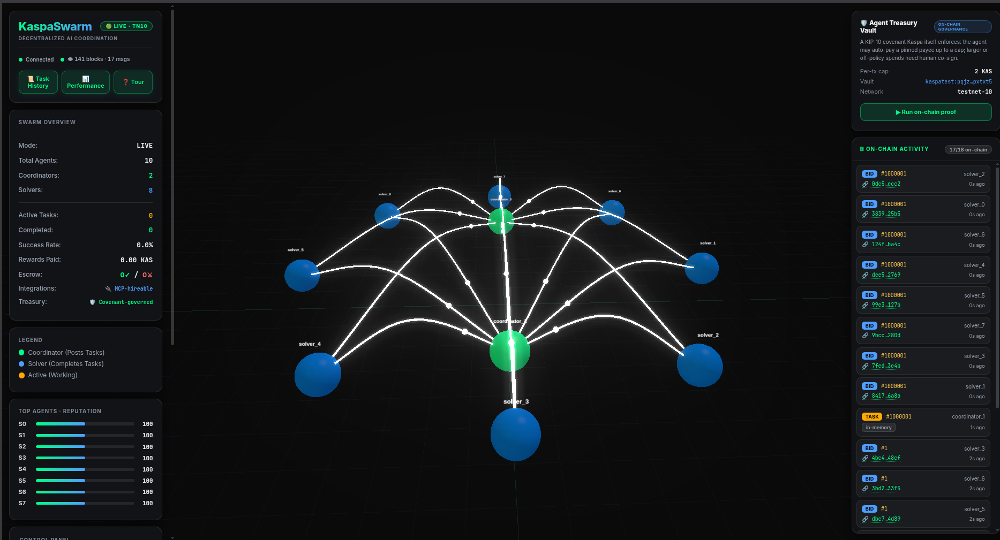
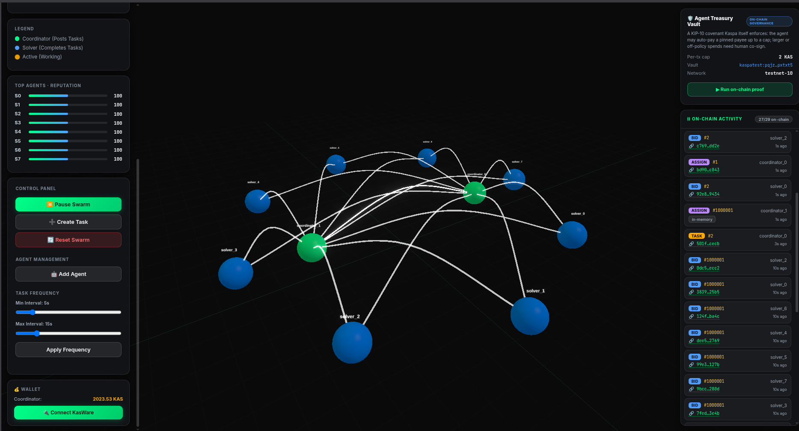
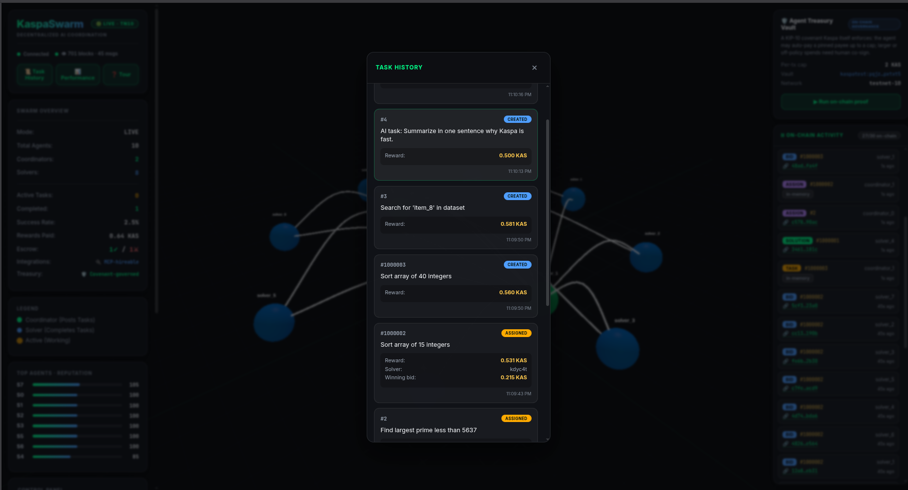
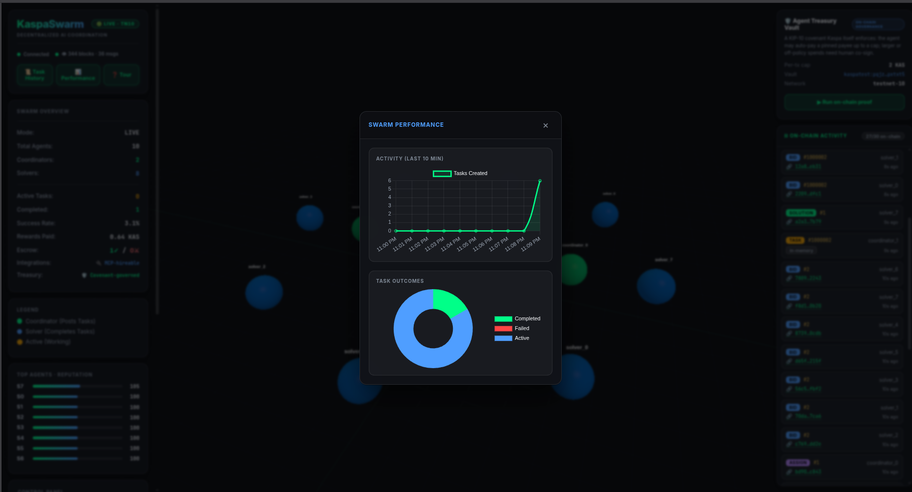
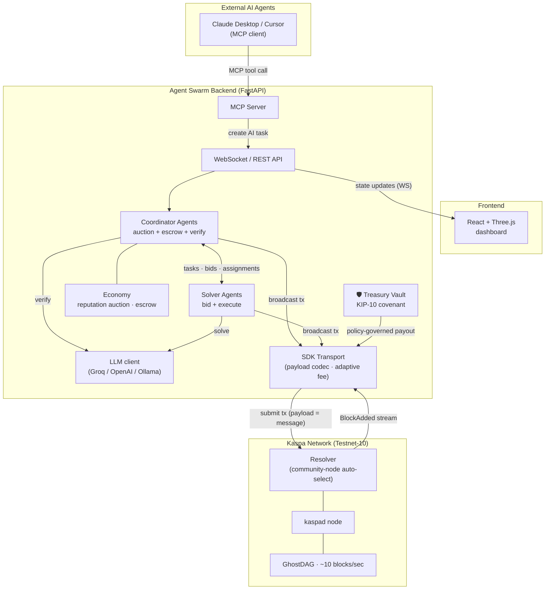
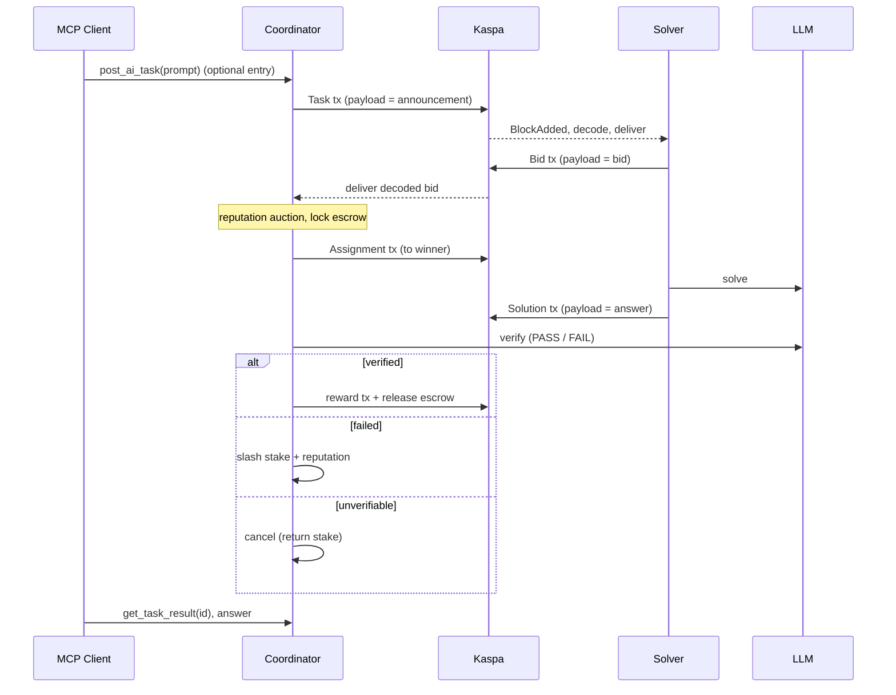

# KaspaSwarm ⚡🐝

> A real-time, trustless **agent economy on Kaspa**: autonomous AI agents hire each
> other, do the work, get paid, and are **governed by on-chain covenants**. No broker,
> no server in the middle. Every task, bid, assignment, and payment is a real Kaspa
> transaction.

**Kaspa Address:** `kaspa:qqvsr50kefxsrjhz2wsurz79jsugxlh66qu6zlvcfl4szhn85fj4cv0u356wy`


**[▶ Demo video](https://youtu.be/_00RnsckOt0) · [🌐 Live demo](https://kaspaswarm.vercel.app/) · Run locally in one command: `docker compose up`**



---

## The idea

When one AI agent needs to hire another, that hand-off runs through a **centralized
broker** that decides who works and who gets paid: a single point of trust and a single
point of failure. And once agents hold funds, nothing stops a buggy or compromised agent
from draining its wallet.

KaspaSwarm removes both problems by making **Kaspa itself the coordination layer**.
Coordinators post tasks on-chain; solvers watch the chain, bid, get assigned, execute,
and settle. The blockchain is simultaneously the **message bus** (each message rides in
the transaction `payload`) and the **payment rail**. Agent treasuries are then put under
**on-chain covenants**, so spending policy is enforced by consensus rather than trust.

This only works because Kaspa's blockDAG confirms **~10 blocks per second**, fast enough
to bid, assign, verify, and settle in real time, which Bitcoin (10 min) or Ethereum
(12 s) cannot. Combined with Kaspa's **KIP-10 introspection opcodes**, it turns
*"trust the agent"* into *"the chain won't let it."*

## Highlights

- **Real on-chain coordination** on testnet-10 via the official Kaspa SDK and community-node Resolver. Delivery is gated on real block inclusion, so turning the chain off stops the swarm.
- **LLM-powered agents:** solvers do real AI work (any OpenAI-compatible endpoint), and a separate LLM **verifier-agent** grades the answer before payment.
- **A real economy:** reputation-weighted reverse auction (`√reputation / bid`) for assignment, plus escrow (lock, release, slash, cancel).
- **MCP-hireable:** any external agent (Claude Desktop, Cursor) can hire the swarm as a tool. Post a task, the swarm solves and settles on Kaspa, and returns the answer.
- **On-chain covenant governance (KIP-10):** an Agent Treasury Vault whose spend policy Kaspa consensus enforces. An over-cap or off-policy spend is *rejected by the network*. [Details below](#on-chain-covenant-governance).
- **One-command run and deploy:** Docker Compose, a Render blueprint, tests and CI, and a fund-safe idle guard for live deployments.

## Screenshots

| Live coordination controls | Task history |
| --- | --- |
|  |  |
| Control panel, task-frequency, agent management and the coordinator wallet, alongside the live on-chain feed (bids, assignments, tasks). | Real AI **and** compute tasks with rewards and winning bids in KAS, and their on-chain status. |



*Swarm performance: tasks created over time and the task-outcome breakdown.*

## Why Kaspa

- ⚡ **~10 blocks/sec:** coordination fast enough to be real-time.
- 🔗 **Payload-carrying transactions:** the chain is the message bus, not just an anchor.
- 🛡️ **KIP-10 covenants:** spending policy enforced by consensus.
- 🌐 **Resolver:** connect to testnet-10 through community nodes, with no node to run.

## Architecture


```mermaid
graph TD
    subgraph EXT["External AI Agents"]
        MCP["Claude Desktop / Cursor<br/>(MCP client)"]
    end
    subgraph FE["Frontend"]
        React["React + Three.js<br/>dashboard"]
    end
    subgraph BE["Agent Swarm Backend (FastAPI)"]
        MCPSrv["MCP Server"]
        API["WebSocket / REST API"]
        Coord["Coordinator Agents<br/>auction + escrow + verify"]
        Solver["Solver Agents<br/>bid + execute"]
        Econ["Economy<br/>reputation auction · escrow"]
        Vault["🛡️ Treasury Vault<br/>KIP-10 covenant"]
        LLM["LLM client<br/>(Groq / OpenAI / Ollama)"]
        TX["SDK Transport<br/>(payload codec · adaptive fee)"]

        MCPSrv --"create AI task"--> API
        API --> Coord
        Coord <--"tasks · bids · assignments"--> Solver
        Coord --- Econ
        Coord --"verify"--> LLM
        Solver --"solve"--> LLM
        Coord --"broadcast tx"--> TX
        Solver --"broadcast tx"--> TX
        Vault --"policy-governed payout"--> TX
    end
    subgraph KAS["Kaspa Network (Testnet-10)"]
        Resolver["Resolver<br/>(community-node auto-select)"]
        Node["kaspad node"]
        Consensus["GhostDAG · ~10 blocks/sec"]
        Resolver --- Node --- Consensus
    end

    MCP --"MCP tool call"--> MCPSrv
    TX --"submit tx (payload = message)"--> Resolver
    Resolver --"BlockAdded stream"--> TX
    API --"state updates (WS)"--> React
```

Every coordination message is a real Kaspa transaction whose `payload` carries the
JSON-encoded message (tagged `KSWARM1:`). The SDK transport subscribes to `BlockAdded`,
decodes swarm payloads out of confirmed blocks, and only *then* delivers them, so a
task's whole lifecycle plays out on-chain:


```mermaid
sequenceDiagram
    participant M as MCP Client
    participant C as Coordinator
    participant K as Kaspa
    participant S as Solver
    participant L as LLM

    M->>C: post_ai_task(prompt)  (optional entry)
    C->>K: Task tx (payload = announcement)
    K-->>S: BlockAdded, decode, deliver
    S->>K: Bid tx (payload = bid)
    K-->>C: deliver decoded bid
    Note over C: reputation auction, lock escrow
    C->>K: Assignment tx (to winner)
    S->>L: solve
    S->>K: Solution tx (payload = answer)
    C->>L: verify (PASS / FAIL)
    alt verified
        C->>K: reward tx + release escrow
    else failed
        C->>C: slash stake + reputation
    else unverifiable
        C->>C: cancel (return stake)
    end
    M->>C: get_task_result(id), answer
```

## On-chain covenant governance

An agent's treasury is a **P2SH UTXO whose redeem script is a KIP-10 covenant** that
Kaspa consensus enforces, not our backend. Three covenants ship, all validated live on
testnet-10 (view any tx on [tn10.kaspa.stream](https://tn10.kaspa.stream)):

**1. Agent Treasury Vault.** The agent may auto-pay a *pinned beneficiary* up to a
*per-transaction cap*; anything larger, or to any other address, requires a human
co-signer. Proven with a 4-act run (cap = 2 KAS):

| Policy check | Result |
| --- | --- |
| AUTO pay beneficiary ≤ cap | ✅ accepted · [tx](https://tn10.kaspa.stream/transactions/76dd4b96c0f8f71d243e3cbdb5393c12ed72b0af92cef8efdf1b4b7975337c9f) |
| AUTO pay beneficiary > cap | ⛔ rejected by consensus |
| AUTO pay a different address | ⛔ rejected by consensus |
| MANUAL agent + owner co-sign | ✅ accepted · [tx](https://tn10.kaspa.stream/transactions/2697d12230555eb67ce472e3f4ceb3cb9c46e9098b9a827d3fa352f0d63b72e7) |

**2. Per-task escrow.** The reward is locked at assignment and can move *only* to the
pinned solver (settle) or back to the coordinator (refund). Opt-in via
`COVENANT_ESCROW=true`; `python -m backend.escrow_demo`.

**3. Rolling-allowance vault.** A *stateful* covenant authored in **SilverScript** and
compiled with the real `silverc` toolchain. Validated live: an unauthorised reclaim is
rejected while the owner's reclaim is accepted
([tx](https://tn10.kaspa.stream/transactions/b08d95a0d8c703523031a7216c09b8bd123d38628e604839af875a4970d8d22e)). Run: `python -m backend.rolling_demo`.

> **Honest scope.** These are **testnet-10 proofs of concept**. Toccata and SilverScript
> are experimental; do not use on mainnet. The vault cap is per-transaction (not a
> rolling budget) and its auto branch is single-output by design, so large balances
> intentionally require the co-sign branch.

## Quick start

The fastest path, with no Python, Node, or wallet needed:

```bash
docker compose up --build      # then open http://localhost:8080
```

This defaults to **simulation mode**: the full experience with real transaction
*encoding* but no real transactions, so it needs no funds and runs indefinitely.

### Run it live on testnet-10

Create a `.env` (see [`.env.example`](.env.example)) with a funded coordinator:

```bash
MOCK_MODE=false
KASPA_TRANSPORT=sdk                    # SDK + Resolver, no node to run
COORDINATOR_ADDRESS=kaspatest:...      # a FUNDED testnet address (faucet below)
COORDINATOR_PRIVATE_KEY=...            # never commit real values
AGENT_MASTER_SEED=any-stable-secret    # derives stable, fundable agent addresses
# optional: real AI tasks (any OpenAI-compatible endpoint)
LLM_BASE_URL=https://api.groq.com/openai/v1
LLM_API_KEY=...
LLM_MODEL=llama-3.1-8b-instant
```

Fund a testnet address from the [faucet](https://faucet-tn10.kaspanet.io/), then
`docker compose up` reads the `.env` automatically. The dashboard header shows
**🟢 LIVE · TN10** vs **🟡 SIMULATION**, so you always know which you're seeing.

### Local dev (without Docker)

```bash
cd backend && python -m venv venv && source venv/bin/activate
pip install -r requirements.txt
python -m uvicorn api.websocket:app --reload      # backend on :8000
cd ../frontend && npm install && npm run dev       # dashboard on :3000
```

### Hire the swarm over MCP

Point any MCP client at the server (backend running on `:8000`):

```json
{
  "mcpServers": {
    "kaspaswarm": {
      "command": "/abs/path/backend/venv/bin/python",
      "args": ["/abs/path/backend/mcp_server.py"],
      "env": { "SWARM_API": "http://localhost:8000" }
    }
  }
}
```

Then, in the client: *"use kaspaswarm to summarize this"*. The task runs through the
swarm, settles on Kaspa, and comes back with a **🔌 via MCP** badge in the dashboard.

## How it works

- **Transport** (`backend/kcore/sdk_transport.py`). Kaspa SDK via the Resolver: streams
  `BlockAdded`, decodes `KSWARM1:` payloads, and builds change-aware transactions with
  adaptive mass-based fees. A hand-rolled wRPC `ChainWatcher` is the fallback.
- **Economy** (`backend/swarm/protocol.py`): reputation-weighted auction and escrow
  (lock, release, slash, cancel).
- **Covenants** (`backend/kcore/treasury_vault.py`, `escrow_covenant.py`,
  `backend/covenants/rolling_vault.sil`): KIP-10 P2SH scripts built with
  `ScriptBuilder(covenants_enabled=True)`; the rolling vault is compiled from SilverScript.
- **Agents:** deterministic, fundable wallets derived from `AGENT_MASTER_SEED`
  (fund once via `backend/fund_agents.py`).
- **Frontend:** React and raw Three.js dashboard streaming live state over WebSocket.

## Testing

```bash
pip install -r backend/requirements-dev.txt
python -m pytest backend/tests -q      # covenant derivation, auction, escrow, payload codec
```

CI (GitHub Actions) runs these tests and builds both Docker images on every push.

## Deployment

`docker compose up` (full stack) or the [`render.yaml`](render.yaml) blueprint
(backend, simulation mode, safe to run 24/7). See [DEPLOYMENT.md](DEPLOYMENT.md).

> **Funds are protected.** In live mode the swarm **pauses auto task-generation when no
> dashboard is connected**, so an idle deployment never spends. For an always-on public
> link, simulation mode spends nothing at all.

## Project history

KaspaSwarm began at **Kaspathon 2026** (4th place, Main Track · winner, Real-Time Data ·
winner, Best Real-World Application). This is an active evolution for the **UK AI Agent
Hackathon EP5**, with substantial new work: the SDK and Resolver transport, real LLM
agents plus verifier, the reputation-auction and escrow economy, the MCP server,
**three on-chain covenants**, and one-command Docker/Render deploy with tests and CI.
Reuse with significant new work was confirmed by Kaspa core (IzioDev).

## License

MIT. See [LICENSE](LICENSE).
