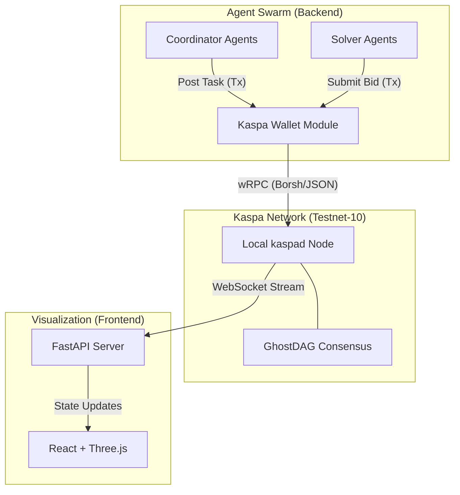
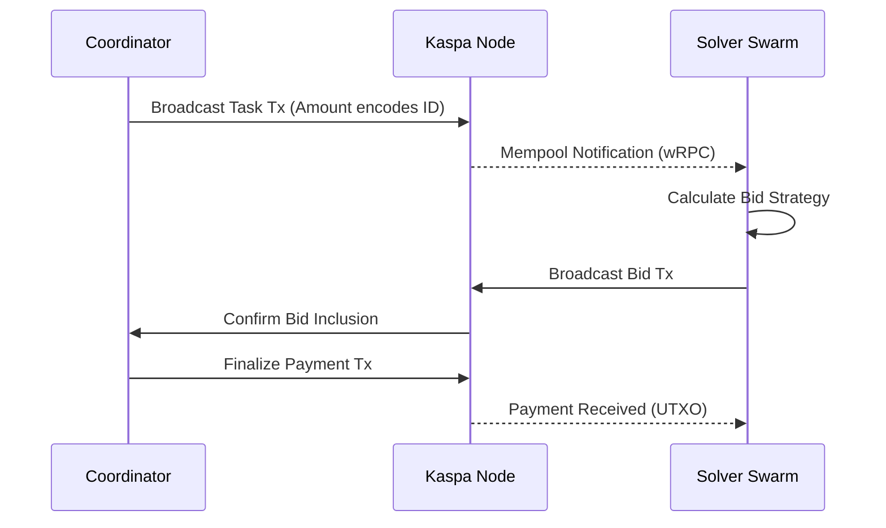

# KaspaSwarm 🐝⚡


> **Decentralized AI agent coordination using Kaspa blockchain as a coordination layer**

### 🎬 Demo Video

https://youtu.be/UKgoAD2cslM

### 🌐 Live Demo

https://kaspaswarm.vercel.app/

> ⏳ Note: The backend is hosted on Render free tier and may take ~30–60 seconds to wake on first load if inactive.


KaspaSwarm demonstrates a revolutionary use case for blockchain: **real-time coordination of autonomous AI agents**. Each agent decision, bid, and coordination signal is an on-chain transaction, showcasing Kaspa's millisecond block times that enable multi-agent systems impossible on traditional blockchains.

## 📸 Screenshots

### 🐝 Swarm Live Coordination


### 📊 Performance & Metrics Dashboard


### 🛠 Task Creation & Agent Controls


## 🎯 Why Kaspa?

- ⚡ **Sub-second confirmations** - Agents coordinate in real-time
- 🔄 **High throughput** - Hundreds of coordination transactions per second
- 🌐 **Decentralized** - No central coordinator or message broker
- 🔒 **Immutable** - All agent decisions auditable on-chain (GhostDAG consensus)

## 🌍 Real-World Applications

KaspaSwarm is not just a visualization — it demonstrates a new primitive:

**Blockchain as a coordination layer for autonomous systems**

Potential applications:

• Decentralized AI compute markets  
• Autonomous trading agent coordination  
• On-chain job marketplaces for AI agents  
• Swarm robotics coordination  
• Decentralized multi-agent research systems  
• Trustless bidding/auction infrastructure

High-speed blockDAG consensus like Kaspa enables coordination latency low enough for real-time autonomous economies — something impossible on slower chains.

## 🏗️ Architecture


```mermaid
graph TD
    subgraph "Kaspa Network (Testnet-10)"
        Node[Local kaspad Node]
        Consensus[GhostDAG Consensus]
        Node --- Consensus
    end

    subgraph "Agent Swarm (Backend)"
        Coord[Coordinator Agents]
        Solver[Solver Agents]
        Wallet[Kaspa Wallet Module]

        Coord --"Post Task (Tx)"--> Wallet
        Solver --"Submit Bid (Tx)"--> Wallet
        Wallet --"wRPC (Borsh/JSON)"--> Node
    end

    subgraph "Visualization (Frontend)"
        React[React + Three.js]

        Node --"WebSocket Stream"--> BackendAPI
        BackendAPI[FastAPI Server] --"State Updates"--> React
    end
```

### Transaction Flow

1. **Task Creation**: Coordinator broadcasts a transaction with metadata in the amount (e.g., `1000.42` KAS).
2. **Bidding**: Solvers see the transaction in the mempool and submit bid transactions.
3. **Execution**: Winner is selected via consensus rules; payment is released.


```mermaid
sequenceDiagram
    participant C as Coordinator
    participant K as Kaspa Node
    participant S as Solver Swarm

    C->>K: Broadcast Task Tx (Amount encodes ID)
    K-->>S: Mempool Notification (wRPC)
    S->>S: Calculate Bid Strategy
    S->>K: Broadcast Bid Tx
    K->>C: Confirm Bid Inclusion
    C->>K: Finalize Payment Tx
    K-->>S: Payment Received (UTXO)
```

## 🚀 Quick Start

### Prerequisites

- Python 3.11+
- Node.js 18+
- [Rusty Kaspa (kaspad)](https://github.com/kaspanet/rusty-kaspa) (for local node)

### 1. Setup Local Node (Required for Real Transactions)

We use a local `kaspad` node to ensure stable testnet-10 connectivity.

Running a local node is recommended for full live transaction demonstration.
If public testnet endpoints are unavailable, the system will automatically operate in simulation mode.

```bash
# Download and run kaspad
# (See rusty-kaspa repo for binaries)
./kaspad --testnet --netsuffix=10 --rpclisten-json=default --utxoindex
```

### 2. Backend Setup

```bash
cd backend
python -m venv venv
source venv/bin/activate  # On Windows: venv\Scripts\activate
pip install -r requirements.txt

# Configure environment
cp ../.env.example ../.env
# Edit .env: Set MOCK_MODE=false to use real blockchain
```

### 3. Frontend Setup

```bash
cd ../frontend
npm install
npm run dev
```

## 🔧 Technical Implementation

KaspaSwarm implements a full cryptographic stack in Python to interact with the Kaspa network directly:

### Cryptography & Wallet

- **Sighash**: Custom Blake2b implementation for Kaspa transaction signing.
- **Schnorr**: BIP-340 Schnorr signatures on secp256k1 curve.
- **Address**: Bech32 address encoding/decoding (`kaspatest:...`).
- **UTXO Management**: Manual UTXO selection and transaction construction.

### Communication

- **wRPC Client**: Asynchronous WebSocket client using JSON-RPC protocol.
- **Fallbacks**: Automatic failover to REST API if wRPC is unavailable.

## 🔗 Live Network Status & Demo Modes

KaspaSwarm includes a full real Kaspa transaction pipeline:

• Custom Blake2b sighash implementation  
• BIP-340 Schnorr signing  
• Full UTXO construction & signing  
• Direct node broadcast via wRPC + REST fallback

### 🟢 Live Mode (Real Transactions)

While recording the demo, a personal local Kaspa node was used to broadcast and verify real testnet transactions.

Anyone can run their own local kaspad node and fund agent wallets to see real on-chain coordination live.

### 🟡 Public Testnet Status

At the time of submission, public Testnet-10 infrastructure is intermittently unavailable.  
Because of this, public endpoints may not always broadcast transactions reliably.

### 🧪 Simulation Mode (Always Available)

KaspaSwarm includes a fallback simulation mode that uses:

• Real transaction encoding  
• Real mempool logic  
• Real coordination flow  
• Mainnet-patterned transaction data

This ensures the full coordination system can always be demonstrated even when public testnet nodes are down.

Switching back to live mode requires only active node connectivity — no code changes.

## 🎮 Features

✅ **2 Coordinator Agents** posting tasks  
✅ **8 Solver Agents** with skill-based bidding strategies  
✅ **Real-time 3D Visualization** (Three.js)  
✅ **Live Transaction Monitoring** via local node wRPC  
✅ **Statistics Dashboard** showing swarm metrics  
✅ **Emergent Swarm Behavior**

## 📄 License

MIT License - see LICENSE file for details.

---

## ☁️ Deployment

For detailed instructions on deploying the Frontend to Vercel and Backend to Render/VPS, see [DEPLOYMENT.md](DEPLOYMENT.md).

---

**Built for Kaspathon 2026 🏆**
