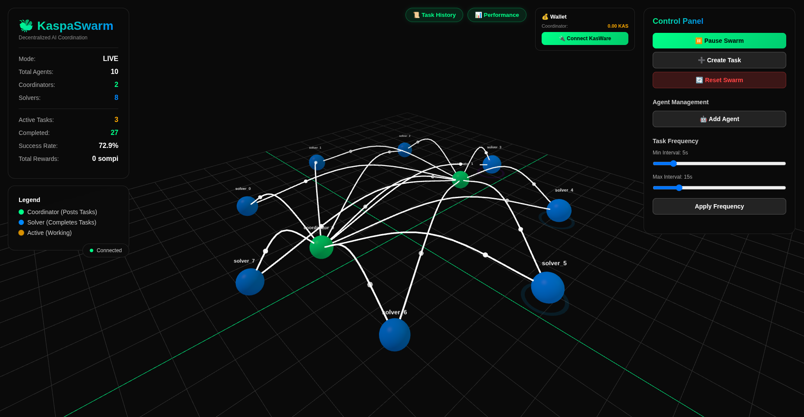
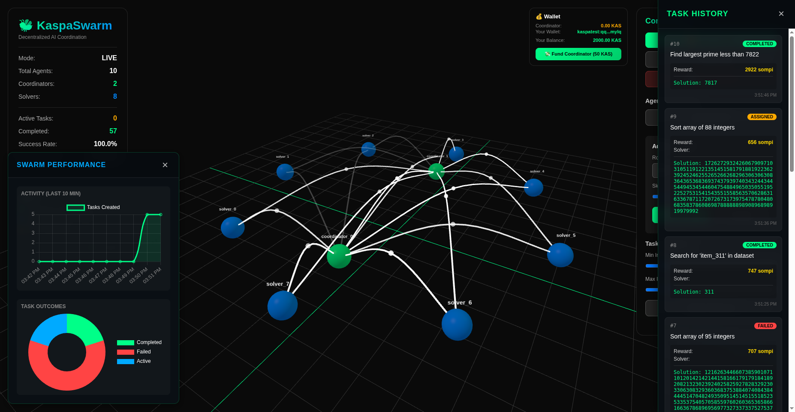
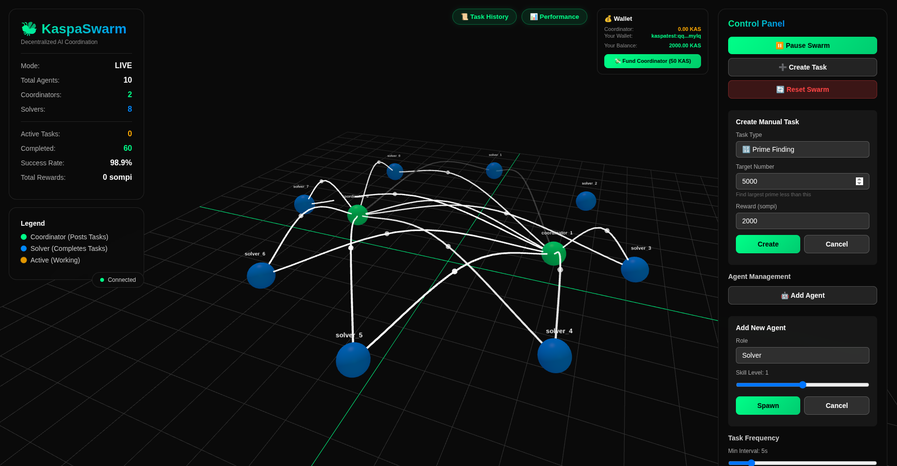
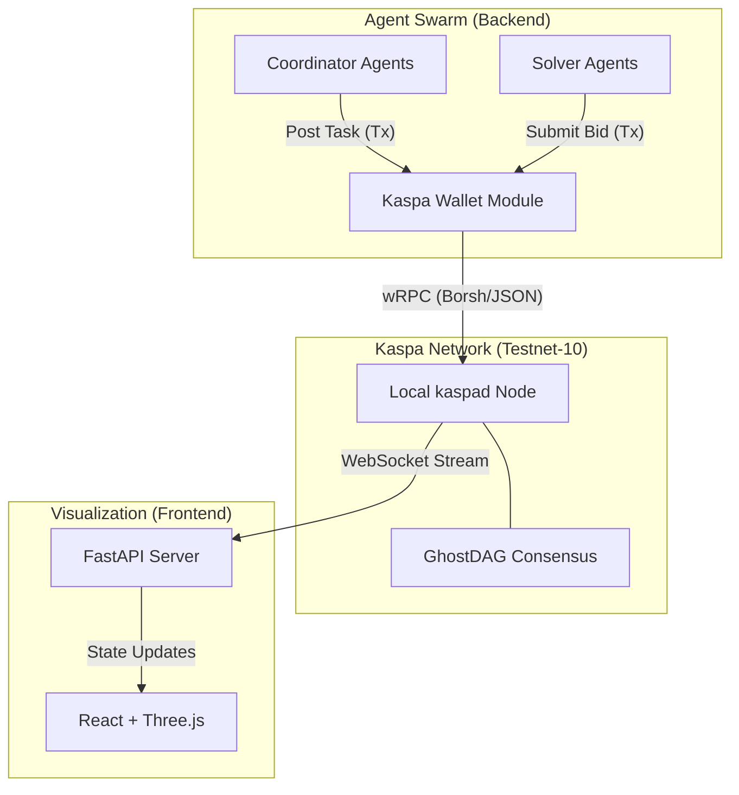
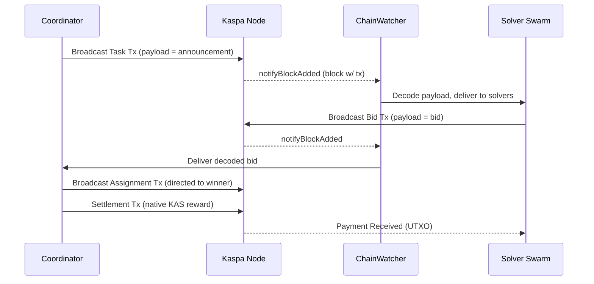

# KaspaSwarm 🐝⚡


> **Decentralized AI agent coordination using Kaspa blockchain as a coordination layer**

### 🎬 Demo Video

https://youtu.be/UKgoAD2cslM

### 🌐 Live Demo

https://kaspaswarm.vercel.app/

> ⏳ Note: The backend is hosted on Render free tier and may take ~30–60 seconds to wake on first load if inactive.


> **KaspaSwarm turns Kaspa into a real-time, decentralized coordination-and-settlement layer where autonomous AI agents hire each other, do the work, and get paid — no servers, no brokers, no trust required.**

Today, when one AI agent needs to hire another, that coordination runs through a **centralized broker** that decides who works and who gets paid. KaspaSwarm removes the broker: **coordinators** post tasks on-chain, **solvers** watch the chain, bid, get assigned, execute, and settle — every task, bid, assignment, and payment is a real Kaspa transaction (carried in the transaction *payload*). The blockchain is simultaneously the **message bus** and the **payment rail**, and the entire coordination history is public and auditable.

This is only possible because Kaspa's **blockDAG confirms ~10 blocks/second** — fast enough for agents to bid → assign → settle in real time, which slower chains (Bitcoin's 10-min, Ethereum's 12-sec blocks) simply cannot do. KaspaSwarm is a proof that a fast L1 can be the coordination bus for real machine-to-machine economies.

## 🆕 Project history & what's new

KaspaSwarm originated at **Kaspathon 2026** (4th place, Main Track · winner, Real-Time Data · winner, Best Real-World Application). This repository is an active evolution of that project for the **UK AI Agent Hackathon EP5**, with substantial new work:

- **Kaspa is now the real coordination bus** — messages moved from the transaction *amount* hack into the transaction *payload* field, plus a new `ChainWatcher` that delivers messages decoded from confirmed blocks (delivery is gated on real block inclusion).
- **Deterministic, fundable agent wallets** + tooling (`fund_agents.py`, `live_test.py`).
- **Correct directed message delivery** and a hardened agent lifecycle.
- **(In progress)** SilverScript covenant settlement (conditional escrow) on Testnet-12.

Prior-project code is disclosed as such; the items above are new work for this event.

## 📸 Screenshots

### 🐝 Swarm Live Coordination



### 📊 Performance & Metrics Dashboard



### 🛠 Task Creation & Agent Controls



## 🎯 Why Kaspa?

- ⚡ **Sub-second confirmations** - Agents coordinate in real-time
- 🔄 **High throughput** - Hundreds of coordination transactions per second
- 🌐 **Decentralized** - No central coordinator or message broker
- 🔒 **Immutable** - All agent decisions auditable on-chain (GhostDAG consensus)

## 🌍 Real-World Applications

KaspaSwarm is not just a visualization — it demonstrates a new primitive:

**Blockchain as a coordination layer for autonomous systems**

Potential applications:

• Decentralized AI compute markets  
• Autonomous trading agent coordination  
• On-chain job marketplaces for AI agents  
• Swarm robotics coordination  
• Decentralized multi-agent research systems  
• Trustless bidding/auction infrastructure

High-speed blockDAG consensus like Kaspa enables coordination latency low enough for real-time autonomous economies — something impossible on slower chains.

## 🏗️ Architecture


```mermaid
graph TD
    subgraph "Kaspa Network (Testnet-10)"
        Node[Local kaspad Node]
        Consensus[GhostDAG Consensus]
        Node --- Consensus
    end

    subgraph "Agent Swarm (Backend)"
        Coord[Coordinator Agents]
        Solver[Solver Agents]
        Wallet[Kaspa Wallet Module]

        Coord --"Post Task (Tx)"--> Wallet
        Solver --"Submit Bid (Tx)"--> Wallet
        Wallet --"wRPC (Borsh/JSON)"--> Node
    end

    subgraph "Visualization (Frontend)"
        React[React + Three.js]

        Node --"WebSocket Stream"--> BackendAPI
        BackendAPI[FastAPI Server] --"State Updates"--> React
    end
```

### Transaction Flow — Kaspa as the coordination bus

Every coordination message (task, bid, assignment, solution) is a **real Kaspa
transaction whose `payload` field carries the full, JSON-encoded message** (tagged
with a `KSWARM1:` magic prefix). A `ChainWatcher` subscribes to block
notifications, decodes swarm payloads out of confirmed blocks, and only *then*
delivers them to the recipient agent. **Delivery is gated on real block inclusion**
— turn the chain off and the swarm stops. Kaspa is the medium, not a decorative anchor.

1. **Task Creation**: Coordinator broadcasts a tx; the `payload` is the task announcement.
2. **Observation**: The `ChainWatcher` sees the block, decodes the payload, delivers it to solvers.
3. **Bidding**: Solvers broadcast bid txs (payload-encoded) from their own funded addresses.
4. **Assignment**: Coordinator selects a bid and broadcasts a directed assignment tx to the winner.
5. **Settlement**: On an accepted solution, the reward is paid as a native KAS transfer.


```mermaid
sequenceDiagram
    participant C as Coordinator
    participant K as Kaspa Node
    participant W as ChainWatcher
    participant S as Solver Swarm

    C->>K: Broadcast Task Tx (payload = announcement)
    K-->>W: notifyBlockAdded (block w/ tx)
    W->>S: Decode payload, deliver to solvers
    S->>K: Broadcast Bid Tx (payload = bid)
    K-->>W: notifyBlockAdded
    W->>C: Deliver decoded bid
    C->>K: Broadcast Assignment Tx (directed to winner)
    C->>K: Settlement Tx (native KAS reward)
    K-->>S: Payment Received (UTXO)
```

> A bulletproof in-memory fallback delivers messages if a broadcast fails, so a
> flaky node never freezes a live demo. In simulation mode the same flow runs
> entirely in-memory.

## 🚀 Quick Start

### Prerequisites

- Python 3.11+
- Node.js 18+
- [Rusty Kaspa (kaspad)](https://github.com/kaspanet/rusty-kaspa) (for local node)

### 1. Setup Local Node (Required for Real Transactions)

We use a local `kaspad` node to ensure stable testnet-10 connectivity.

Running a local node is recommended for full live transaction demonstration.
If public testnet endpoints are unavailable, the system will automatically operate in simulation mode.

```bash
# Download and run kaspad
# (See rusty-kaspa repo for binaries)
./kaspad --testnet --netsuffix=10 --rpclisten-json=default --utxoindex
```

### 2. Backend Setup

```bash
cd backend
python -m venv venv
source venv/bin/activate  # On Windows: venv\Scripts\activate
pip install -r requirements.txt

# Configure environment
cp ../.env.example ../.env
```

Edit `.env` for **live mode**:

```bash
MOCK_MODE=false
KASPA_WS_URL=ws://127.0.0.1:18210          # your local node's JSON wRPC
COORDINATOR_ADDRESS=kaspatest:...          # a FUNDED testnet address
COORDINATOR_PRIVATE_KEY=...                # its private key (never commit real values)
AGENT_MASTER_SEED=any-stable-secret        # derives stable, fundable agent addresses
```

Then fund the agents and validate the on-chain bus (node must be synced):

```bash
python backend/fund_agents.py check        # list agent addresses + balances
python backend/fund_agents.py fund 25      # send 25 TKAS to each solver
python backend/live_test.py                # broadcast 1 probe, confirm watcher decodes it
```

> Leave `MOCK_MODE=true` to run the full coordination flow in-memory with no node.

### 3. Frontend Setup

```bash
cd ../frontend
npm install
npm run dev
```

## 🔧 Technical Implementation

KaspaSwarm implements a full cryptographic stack in Python to interact with the Kaspa network directly:

### Cryptography & Wallet

- **Sighash**: Custom Blake2b implementation for Kaspa transaction signing.
- **Schnorr**: BIP-340 Schnorr signatures on secp256k1 curve.
- **Address**: Bech32 address encoding/decoding (`kaspatest:...`).
- **UTXO Management**: Manual UTXO selection and transaction construction.

### Communication

- **wRPC Client**: Asynchronous WebSocket client using JSON-RPC protocol.
- **Fallbacks**: Automatic failover to REST API if wRPC is unavailable.

### On-Chain Coordination Bus

- **Payload transport**: Full coordination messages are serialized into the Kaspa
  transaction `payload` field (`backend/kcore/transaction.py`), committed to by the
  sighash — not crammed into the amount. No size/ID limits from the old scheme.
- **ChainWatcher** (`backend/kcore/chain_watcher.py`): subscribes to `notifyBlockAdded`,
  scans each block's transactions for `KSWARM1:` payloads, resolves the recipient from
  output addresses, dedups by tx id, and delivers decoded messages to agents — so
  coordination genuinely flows *through* the chain. Auto-reconnects with backoff.
- **Deterministic agent wallets**: each agent derives a stable address from a master
  seed (`AGENT_MASTER_SEED`), so addresses persist across restarts and can be funded
  once (see `backend/fund_agents.py`).

## 🔗 Live Network Status & Demo Modes

KaspaSwarm includes a full real Kaspa transaction pipeline:

• Custom Blake2b sighash implementation  
• BIP-340 Schnorr signing  
• Full UTXO construction & signing  
• Direct node broadcast via wRPC + REST fallback

### 🟢 Live Mode (Real Transactions)

While recording the demo, a personal local Kaspa node was used to broadcast and verify real testnet transactions.

Anyone can run their own local kaspad node and fund agent wallets to see real on-chain coordination live.

### 🟡 Public Testnet Status

At the time of submission, public Testnet-10 infrastructure is intermittently unavailable.  
Because of this, public endpoints may not always broadcast transactions reliably.

### 🧪 Simulation Mode (Always Available)

KaspaSwarm includes a fallback simulation mode that uses:

• Real transaction encoding  
• Real mempool logic  
• Real coordination flow  
• Mainnet-patterned transaction data

This ensures the full coordination system can always be demonstrated even when public testnet nodes are down.

Switching back to live mode requires only active node connectivity — no code changes.

## 🎮 Features

✅ **2 Coordinator Agents** posting tasks  
✅ **8 Solver Agents** with skill-based bidding strategies  
✅ **Real-time 3D Visualization** (Three.js)  
✅ **Live Transaction Monitoring** via local node wRPC  
✅ **Statistics Dashboard** showing swarm metrics  
✅ **Emergent Swarm Behavior**

## 📄 License

MIT License - see LICENSE file for details.

---

## ☁️ Deployment

For detailed instructions on deploying the Frontend to Vercel and Backend to Render/VPS, see [DEPLOYMENT.md](DEPLOYMENT.md).

---

**Built for Kaspathon 2026 🏆**
